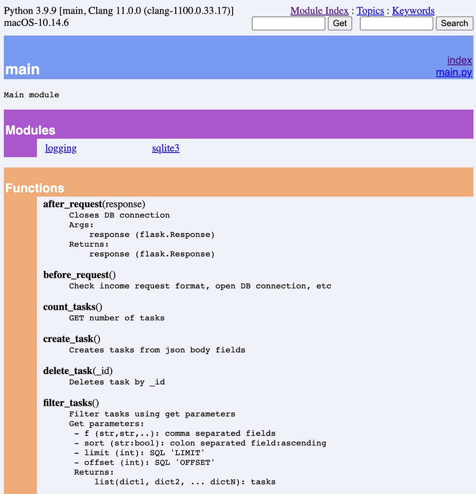

## Description

Simple REST service for tasks managing.

## Installation

**Requirements:**
```
pip install -r requirements.txt
```

**Database:**
```
./scripts/create_db.sh /where/to/place/db.sqlite3 ./scripts/db_init.sql
```

**Configuration:**

Base configuration: config/default.json. 

By default `APP_ENV_PFX` defines prefix for env variables (default=TODO_APP). Thus, LOCAL_CONFIG path should be defined as: 

```
export TODO_APP_LOCAL_CONFIG=/path/to/config.json
```

## Running application

```
export FLASK_APP=app.py
[export APP RELATED ENV VARS]
python -m flask run
```

## Usage

Use pydoc. For example `pydoc main` prints:

```
Help on module main:

NAME
    main - Main module

FUNCTION
    create_task()
        Creates tasks from json body fields

    delete_task(_id)
        Deletes task by _id

    filter_tasks()
        Filter tasks using get parameters
        Get parameters:
         - f (str,str,..): comma separated fields
         - sort (str:bool): colon separated field:ascending
         - limit (int): SQL 'LIMIT'
         - offset (int): SQL 'OFFSET'
         Returns:
             list(dict1, dict2, ... dictN): tasks
...
```

Or start pydoc server, for example `pydoc -p 8080 .` and use Python built-in interactive help system:




## Contributing

Follow Installation section step. Add development dependencies:

```
pip install -r reqirements-dev.txt
```